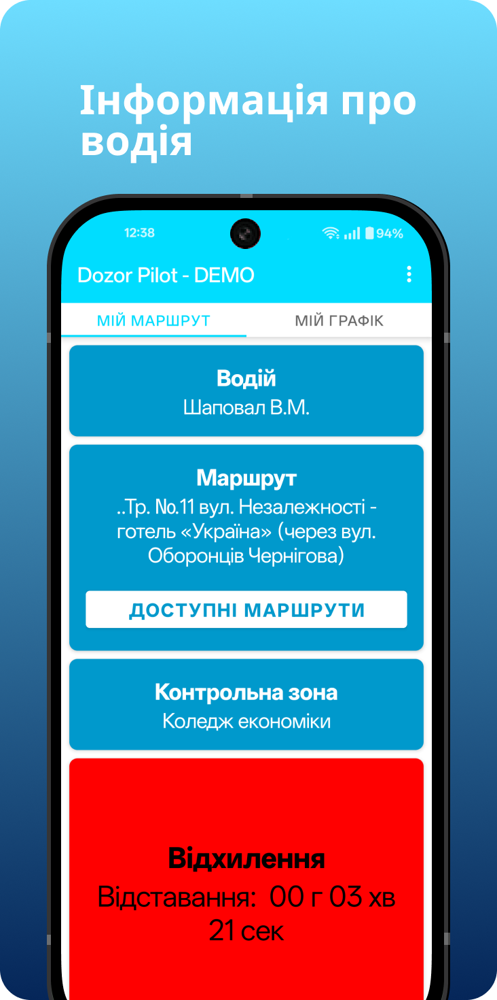

# 👋 Hello, I'm Vladyslav Kolodii
### Android Developer | Kotlin Enthusiast | Open Source Contributor

## 🚀 About Me
Passionate Android developer with a focus on creating elegant, user-friendly mobile applications. I specialize in Kotlin and modern Android development practices, including Jetpack Compose, MVVM architecture, and clean code principles.

## 🛠 Technology Stack

### Architecture & Design Patterns

### Core Development

### UI & Jetpack

### Networking & API

### Database & DI

### Third-Party SDKs & Services

### Version Control

## 📱 Project Highlights

### 🚰 Water Intake Tracking App

### 🚗 Public Transport Driver App

## 🌟 Featured Projects

# 💧 Water Intake Tracking App

An app designed to help users stay hydrated by tracking water intake and providing smart reminders.

## 🚀 Features

- **Google and Facebook Authentication** – Seamless login experience.
- **User Profile System** – Input personal details like name, age, and weight.
- **Smart Reminders** – Local notifications remind users to drink water, with an option to mute at night.
- **Data Management** – CRUD operations for user data with statistics (daily, weekly, monthly).
- **Firebase Integration** – Real-time data synchronization between local and remote databases.

## 📱 Screenshots

| Main Screen | Progress Widget | Reminder Screen | Goals Dialogs | Pro Advantages |
|------------|----------------|-----------------|---------------|---------------|
|  |  |  |  |  |

---

# 🚗 Dozor Pilot App  

A mobile application designed to assist drivers in the **public sector** by optimizing routes and improving navigation.

## 🚀 Features  

- **Route Management** – Developed logic for interacting with routes.
- **Data Parsing** – Responsible for processing and handling route-related data.
- **Dialogs & UI Development** – Displaying relevant dialogs and enhancing user experience.
- **API Integration** – Integrated third-party APIs for real-time route updates.
- **Performance Optimization** – Improved efficiency and app responsiveness.

---

## 📱 Screenshots

| Login Screen | Driver Screen | Route - Info 1/2 | Route - Info 2/2 | Route Planner | Route Details |
|-------------|--------------|-------------|--------------|--------------|-------|
|  |  |  |  |  |  |

## 🎯 Current Focus
- Exploring Jetpack Compose animations and custom layouts
- Contributing to open-source Android libraries
- Learning about Android performance optimization

## 📫 Let's Connect!
- LinkedIn: https://www.linkedin.com/in/vladyslav-kolodii-4554941b4/
- Email: kolodii841@gmail.com

## 🤝 Open to Collaborate
I'm always interested in collaborating on innovative Android projects. If you have an idea or need help with Android development, feel free to reach out!

